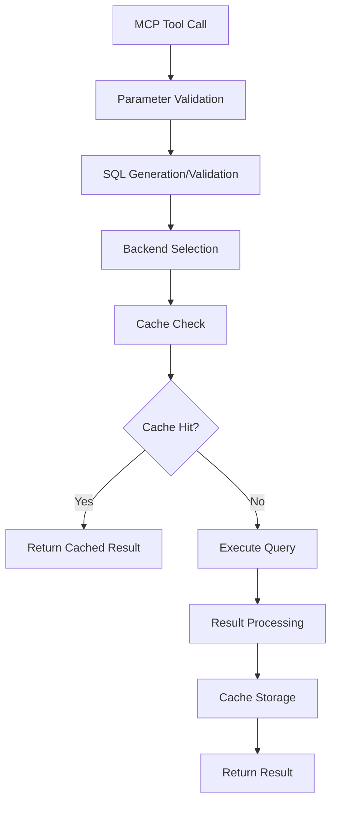

# Execution & Caching Architecture

This document explains the execution architecture, caching strategies, and performance optimization features of the OMOP MCP server.

## Architecture Overview

The OMOP MCP server implements a pluggable backend architecture with comprehensive caching and performance optimization:

```
MCP Client → FastMCP Server → Backend Registry → Database Backend → OMOP Database
                    ↓
              Cache Layer (LRU)
                    ↓
              Validation Layer
```

## Backend Abstraction

### Base Backend Protocol

All database backends implement the `OmopDatabase` protocol:

```python
class OmopDatabase(Protocol):
    """Protocol for OMOP database backends."""

    async def validate_sql(self, sql: str) -> SQLValidationResult:
        """Validate SQL query without execution."""

    async def execute_query(self, sql: str, limit: int = 1000) -> list[dict[str, Any]]:
        """Execute SQL query and return results."""

    async def get_schema_info(self, table_name: str) -> dict[str, Any]:
        """Get schema information for a table."""

    def get_backend_name(self) -> str:
        """Return backend name."""

    def get_dialect(self) -> str:
        """Return SQL dialect."""
```

### Backend Registry

The backend registry manages available backends and provides a unified interface:

```python
class BackendRegistry:
    """Registry for OMOP database backends."""

    def __init__(self):
        self._backends: dict[str, OmopDatabase] = {}
        self._register_default_backends()

    def register_backend(self, name: str, backend: OmopDatabase) -> None:
        """Register a new backend."""

    def get_backend(self, name: str) -> OmopDatabase:
        """Get backend by name."""

    def list_backends(self) -> list[str]:
        """List available backends."""
```

### Supported Backends

#### DuckDB (Local Development)
- **Use Case**: Local development, testing, small datasets
- **Performance**: Fastest for local queries
- **Features**: In-memory or file-based, no credentials needed
- **Limitations**: Single-user, limited scalability

```python
class DuckDBBackend(OmopDatabase):
    def __init__(self, database_path: str = ":memory:", schema: str = "main"):
        self.database_path = database_path
        self.schema = schema
        self.connection = duckdb.connect(database_path)
```

#### BigQuery (Cloud Analytics)
- **Use Case**: Cloud-scale analytics, production deployments
- **Performance**: Excellent for large datasets, automatic scaling
- **Features**: Dry-run validation, cost estimation, result caching
- **Limitations**: Requires GCP credentials, query costs

```python
class BigQueryBackend(OmopDatabase):
    def __init__(self, project_id: str, dataset_id: str, credentials_path: str | None = None):
        self.client = bigquery.Client(
            project=project_id,
            credentials=credentials_path
        )
        self.dataset_id = dataset_id
```

#### Snowflake (Enterprise Data Warehouse)
- **Use Case**: Enterprise analytics, large-scale production
- **Performance**: Excellent for complex analytics, automatic scaling
- **Features**: Result caching, warehouse optimization, role-based access
- **Limitations**: Requires Snowflake credentials, enterprise licensing

```python
class SnowflakeBackend(OmopDatabase):
    def __init__(self, account: str, user: str, password: str,
                 database: str, schema: str, warehouse: str):
        self.connector = snowflake.connector.connect(
            account=account,
            user=user,
            password=password,
            database=database,
            schema=schema,
            warehouse=warehouse
        )
```

## Query Execution Flow

### 1. Request Processing



### 2. SQL Validation Pipeline

```python
async def execute_query_with_validation(
    sql: str,
    backend: str,
    limit: int = 1000
) -> QueryResult:
    """Execute query with comprehensive validation."""

    # 1. Syntax validation
    validate_sql_syntax(sql)

    # 2. Security validation
    validate_security(sql)

    # 3. Table allowlist validation
    validate_table_allowlist(sql)

    # 4. Column blocklist validation
    validate_column_blocklist(sql)

    # 5. Backend-specific validation
    backend_impl = get_backend(backend)
    validation_result = await backend_impl.validate_sql(sql)

    # 6. Cost validation (BigQuery)
    if validation_result.estimated_cost_usd > config.max_query_cost_usd:
        raise CostLimitExceededError("Query exceeds cost limit")

    # 7. Execute query
    results = await backend_impl.execute_query(sql, limit)

    return QueryResult(
        results=results,
        validation=validation_result,
        execution_time_ms=execution_time,
        backend=backend
    )
```

### 3. Error Handling & Retry Logic

```python
from tenacity import retry, stop_after_attempt, wait_exponential

@retry(
    stop=stop_after_attempt(3),
    wait=wait_exponential(multiplier=1, min=4, max=10)
)
async def execute_with_retry(
    sql: str,
    backend: OmopDatabase,
    limit: int = 1000
) -> list[dict[str, Any]]:
    """Execute query with automatic retry on failure."""

    try:
        return await backend.execute_query(sql, limit)
    except TemporaryError as e:
        logger.warning("Temporary error, retrying", error=str(e))
        raise
    except PermanentError as e:
        logger.error("Permanent error, not retrying", error=str(e))
        raise
```

## Caching Strategy

### LRU Cache Implementation

The server implements a multi-level caching strategy:

#### 1. ATHENA API Cache (LRU)

```python
from functools import lru_cache
from typing import Dict, Any

class AthenaCache:
    """LRU cache for ATHENA API responses."""

    def __init__(self, max_size: int = 1000):
        self.cache: Dict[str, Any] = {}
        self.max_size = max_size
        self.access_order: List[str] = []

    def get(self, key: str) -> Any | None:
        """Get cached value."""
        if key in self.cache:
            # Move to end (most recently used)
            self.access_order.remove(key)
            self.access_order.append(key)
            return self.cache[key]
        return None

    def put(self, key: str, value: Any) -> None:
        """Store value in cache."""
        if len(self.cache) >= self.max_size:
            # Remove least recently used
            lru_key = self.access_order.pop(0)
            del self.cache[lru_key]

        self.cache[key] = value
        self.access_order.append(key)
```

#### 2. Query Result Cache

```python
class QueryResultCache:
    """Cache for query results with TTL."""

    def __init__(self, ttl_seconds: int = 3600):
        self.cache: Dict[str, CachedResult] = {}
        self.ttl_seconds = ttl_seconds

    async def get(self, cache_key: str) -> Any | None:
        """Get cached query result."""
        if cache_key in self.cache:
            cached_result = self.cache[cache_key]
            if not cached_result.is_expired():
                return cached_result.data
            else:
                del self.cache[cache_key]
        return None

    async def put(self, cache_key: str, data: Any) -> None:
        """Store query result in cache."""
        self.cache[cache_key] = CachedResult(
            data=data,
            timestamp=time.time(),
            ttl=self.ttl_seconds
        )

class CachedResult:
    """Cached result with expiration."""

    def __init__(self, data: Any, timestamp: float, ttl: int):
        self.data = data
        self.timestamp = timestamp
        self.ttl = ttl

    def is_expired(self) -> bool:
        """Check if result has expired."""
        return time.time() - self.timestamp > self.ttl
```

#### 3. Backend-Specific Caching

**BigQuery Cache (24 hours)**
```python
class BigQueryCache:
    """BigQuery-specific caching with 24-hour TTL."""

    def __init__(self):
        self.cache_ttl = 24 * 3600  # 24 hours
        self.query_cache: Dict[str, CachedQuery] = {}

    async def get_cached_result(self, query_hash: str) -> Any | None:
        """Get cached BigQuery result."""
        if query_hash in self.query_cache:
            cached_query = self.query_cache[query_hash]
            if not cached_query.is_expired():
                return cached_query.result
        return None
```

**Snowflake Cache (Utilizes Snowflake's built-in caching)**
```python
class SnowflakeCache:
    """Snowflake cache utilizes warehouse result cache."""

    async def execute_with_cache(self, sql: str) -> list[dict[str, Any]]:
        """Execute query with Snowflake result cache."""
        # Snowflake automatically caches results for identical queries
        # within the same warehouse session
        return await self.connector.execute(sql)
```

### Cache Key Generation

```python
import hashlib
import json

def generate_cache_key(
    sql: str,
    backend: str,
    parameters: dict[str, Any] | None = None
) -> str:
    """Generate cache key for query."""

    # Normalize SQL (remove whitespace, case-insensitive)
    normalized_sql = " ".join(sql.upper().split())

    # Create hash of query and parameters
    cache_data = {
        "sql": normalized_sql,
        "backend": backend,
        "parameters": parameters or {}
    }

    cache_string = json.dumps(cache_data, sort_keys=True)
    return hashlib.sha256(cache_string.encode()).hexdigest()
```

## Performance Optimization

### 1. Connection Pooling

```python
class ConnectionPool:
    """Database connection pool for performance."""

    def __init__(self, max_connections: int = 10):
        self.max_connections = max_connections
        self.connections: List[Connection] = []
        self.available_connections: Queue[Connection] = Queue()
        self.busy_connections: Set[Connection] = set()

    async def get_connection(self) -> Connection:
        """Get available connection from pool."""
        if not self.available_connections.empty():
            return self.available_connections.get()

        if len(self.connections) < self.max_connections:
            conn = await self.create_connection()
            self.connections.append(conn)
            return conn

        # Wait for available connection
        return await self.wait_for_connection()

    async def return_connection(self, conn: Connection) -> None:
        """Return connection to pool."""
        self.busy_connections.remove(conn)
        self.available_connections.put(conn)
```

### 2. Query Optimization

**Automatic LIMIT Injection**
```python
def optimize_query(sql: str, limit: int = 1000) -> str:
    """Optimize query for performance."""

    sql_upper = sql.upper()

    # Add LIMIT if not present
    if "LIMIT" not in sql_upper:
        sql = f"{sql.rstrip()}\nLIMIT {limit}"

    # Optimize for BigQuery
    if "BIGQUERY" in sql_upper:
        sql = optimize_bigquery_query(sql)

    return sql

def optimize_bigquery_query(sql: str) -> str:
    """BigQuery-specific optimizations."""

    # Add partitioning hints
    if "WHERE" in sql.upper():
        sql = add_partition_hints(sql)

    # Optimize JOIN order
    sql = optimize_join_order(sql)

    return sql
```

**Cost-Aware Query Planning**
```python
class CostAwarePlanner:
    """Plan queries based on cost estimates."""

    async def plan_query(self, sql: str) -> QueryPlan:
        """Create cost-aware query execution plan."""

        # Estimate cost
        cost_estimate = await self.estimate_cost(sql)

        # Choose execution strategy
        if cost_estimate < 0.01:  # Low cost
            return QueryPlan(
                strategy="direct_execution",
                timeout=30,
                retry_count=3
            )
        elif cost_estimate < 1.0:  # Medium cost
            return QueryPlan(
                strategy="validated_execution",
                timeout=60,
                retry_count=2
            )
        else:  # High cost
            return QueryPlan(
                strategy="dry_run_first",
                timeout=120,
                retry_count=1
            )
```

### 3. Resource Management

**Memory Management**
```python
class ResourceManager:
    """Manage system resources for query execution."""

    def __init__(self, max_memory_mb: int = 1024):
        self.max_memory_mb = max_memory_mb
        self.current_memory_mb = 0
        self.active_queries: Set[str] = set()

    async def allocate_memory(self, query_id: str, estimated_mb: int) -> bool:
        """Allocate memory for query execution."""

        if self.current_memory_mb + estimated_mb > self.max_memory_mb:
            return False

        self.current_memory_mb += estimated_mb
        self.active_queries.add(query_id)
        return True

    async def release_memory(self, query_id: str, actual_mb: int) -> None:
        """Release memory after query completion."""

        self.current_memory_mb -= actual_mb
        self.active_queries.remove(query_id)
```

**Timeout Management**
```python
import asyncio
from contextlib import asynccontextmanager

@asynccontextmanager
async def query_timeout(timeout_seconds: int):
    """Context manager for query timeouts."""

    try:
        async with asyncio.timeout(timeout_seconds):
            yield
    except asyncio.TimeoutError:
        logger.error("Query timeout", timeout=timeout_seconds)
        raise QueryTimeoutError(f"Query timed out after {timeout_seconds} seconds")
```

## Monitoring & Observability

### 1. Performance Metrics

```python
from prometheus_client import Counter, Histogram, Gauge

# Query metrics
query_counter = Counter('omop_queries_total', 'Total queries executed', ['backend', 'status'])
query_duration = Histogram('omop_query_duration_seconds', 'Query execution time', ['backend'])
query_cost = Histogram('omop_query_cost_usd', 'Query cost in USD', ['backend'])
cache_hits = Counter('omop_cache_hits_total', 'Cache hits', ['cache_type'])
cache_misses = Counter('omop_cache_misses_total', 'Cache misses', ['cache_type'])

# Resource metrics
active_connections = Gauge('omop_active_connections', 'Active database connections', ['backend'])
memory_usage = Gauge('omop_memory_usage_mb', 'Memory usage in MB')
```

### 2. Query Profiling

```python
class QueryProfiler:
    """Profile query execution for optimization."""

    def __init__(self):
        self.profiles: Dict[str, QueryProfile] = {}

    async def profile_query(self, sql: str, backend: str) -> QueryProfile:
        """Profile query execution."""

        start_time = time.time()

        # Execute with profiling
        result = await self.execute_with_profiling(sql, backend)

        execution_time = time.time() - start_time

        profile = QueryProfile(
            sql=sql,
            backend=backend,
            execution_time_ms=execution_time * 1000,
            rows_returned=len(result),
            memory_used_mb=self.get_memory_usage(),
            cost_usd=result.get('cost_usd', 0)
        )

        self.profiles[sql] = profile
        return profile
```

### 3. Error Tracking

```python
class ErrorTracker:
    """Track and categorize query errors."""

    def __init__(self):
        self.error_counts: Dict[str, int] = {}
        self.error_patterns: Dict[str, List[str]] = {}

    def track_error(self, error: Exception, sql: str) -> None:
        """Track query error."""

        error_type = type(error).__name__
        self.error_counts[error_type] = self.error_counts.get(error_type, 0) + 1

        # Pattern analysis
        if error_type not in self.error_patterns:
            self.error_patterns[error_type] = []

        self.error_patterns[error_type].append(sql[:100])  # First 100 chars
```

## Configuration

### Performance Settings

```python
class PerformanceConfig:
    """Performance-related configuration."""

    # Caching
    enable_query_cache: bool = True
    query_cache_ttl: int = 3600  # 1 hour
    athena_cache_size: int = 1000

    # Connection pooling
    max_connections: int = 10
    connection_timeout: int = 30

    # Resource limits
    max_memory_mb: int = 1024
    max_query_timeout: int = 300  # 5 minutes

    # Cost limits
    max_cost_usd: float = 1.0
    cost_warning_threshold: float = 0.5
```

### Environment Variables

```bash
# Performance settings
ENABLE_QUERY_CACHE=true
QUERY_CACHE_TTL=3600
MAX_CONNECTIONS=10
MAX_MEMORY_MB=1024
MAX_QUERY_TIMEOUT=300

# Cost management
MAX_COST_USD=1.0
COST_WARNING_THRESHOLD=0.5

# Monitoring
ENABLE_METRICS=true
METRICS_PORT=9090
```

## Best Practices

### 1. Query Optimization

- **Use LIMIT clauses**: Always limit result sets for exploration
- **Filter early**: Use WHERE clauses to reduce data scanned
- **Index-aware queries**: Structure queries to use available indexes
- **Batch operations**: Group related queries together

### 2. Caching Strategy

- **Cache frequently accessed data**: Concept definitions, schema info
- **Use appropriate TTL**: Short TTL for dynamic data, long TTL for static data
- **Monitor cache hit rates**: Optimize cache size based on usage patterns
- **Invalidate stale data**: Clear cache when underlying data changes

### 3. Resource Management

- **Connection pooling**: Reuse database connections
- **Memory monitoring**: Track memory usage and set appropriate limits
- **Timeout configuration**: Set reasonable timeouts for different query types
- **Cost monitoring**: Track query costs and set appropriate limits

### 4. Error Handling

- **Graceful degradation**: Continue operation when non-critical components fail
- **Retry logic**: Implement exponential backoff for transient failures
- **Error categorization**: Distinguish between permanent and temporary errors
- **User-friendly messages**: Provide clear error messages to users

## Troubleshooting

### Common Performance Issues

**Slow Query Execution**
- Check query complexity and data volume
- Verify database indexes are being used
- Consider query optimization techniques
- Monitor resource usage (CPU, memory, I/O)

**High Memory Usage**
- Reduce query result set sizes
- Implement query result streaming
- Monitor connection pool usage
- Check for memory leaks in long-running processes

**Cache Misses**
- Analyze cache hit rates
- Adjust cache size and TTL settings
- Review cache key generation strategy
- Consider cache warming strategies

**Connection Timeouts**
- Increase connection timeout settings
- Optimize query performance
- Check network connectivity
- Monitor database server load

### Performance Monitoring

```python
# Example monitoring script
async def monitor_performance():
    """Monitor system performance."""

    while True:
        # Check cache hit rates
        hit_rate = cache.get_hit_rate()
        if hit_rate < 0.8:  # 80% hit rate threshold
            logger.warning("Low cache hit rate", hit_rate=hit_rate)

        # Check memory usage
        memory_usage = get_memory_usage()
        if memory_usage > 0.9:  # 90% memory threshold
            logger.warning("High memory usage", usage=memory_usage)

        # Check active connections
        active_conns = connection_pool.get_active_count()
        if active_conns > 8:  # 80% of max connections
            logger.warning("High connection usage", connections=active_conns)

        await asyncio.sleep(60)  # Check every minute
```

This architecture provides a robust, scalable foundation for OMOP data analysis with comprehensive caching, performance optimization, and monitoring capabilities.
